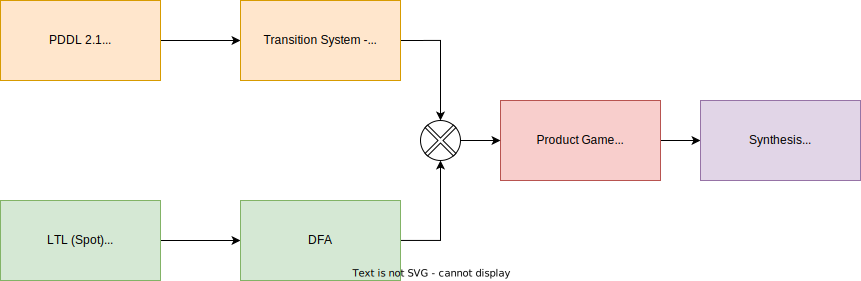

# Project Description

This repository contains code for the paper "Efficient Symbolic Approaches for Quantitative Reactive Synthesis with Finite Tasks." In this work we introduce symbolic algorithms for quantitative reactive synthesis. We consider resource constrained robotic manipulators that need to interact with a human to achieve a complex task expressed in linear temporal logic. This code implement Symbolic Value Iteration for Min-max Reachbility games with quantative constraints as well Hybrid Regret-Minimizing strategy synthesis algorithm. See the [paper](https://arxiv.org/abs/2303.03686) for more details. 



# Authors

* [Karan Muvvala](https://muvvalakaran.github.io/) <[karan.muvvala@colorado.edu](mailto:karan.muvvala@colorado.edu)>

## Instructions to clone the code

clone this repo with:
 ```bash
git clone --recurse-submodules git@github.com:aria-systems-group/sym_quant_reactive_synth.git .
```

Make sure you have Docker installed. If not, follow the instructions [here](https://docs.docker.com/engine/install/ubuntu/).


Note: The ` --recurse-submodule` will automatically initialize and update each submodule in the repository. **The command will throw an error if you do not have access to the private submodule `cudd_and_wrapper`. Please send me an email at :karan.muvvala@colorado.edu so that I can give access to the dependent submodule.**


## Docker Commands to build the image

1. `cd` into the root of the project

2. Build the image from the Dockerfile

```bash
docker build -t <image_name> .
```

Note: the dot looks for a Dockerfile in the current repository.Then spin an instance of the container by using the following command

```bash
docker run -it --name <docker_container_name> <docker image name>

```

For volume binding

```bash
docker run -v <HOST-PATH>:<Container-path>
```

For example 

```bash
docker run -it -v $PWD:/root/symbolic_planning/src --name symbolic_planning sym_planning_image
```

In the above command `symbolic_planning` is the name of the container and `sym_planning_image` is the name of the docker image.

---
Additionally, if you are more used to GUI and would like to edit or attach a container instance to the VSCode ([Link](https://code.visualstudio.com/docs/devcontainers/containers)) then follow the instructions below:

### Attaching the remote container to VScode


1. Make sure you have the right VS code extensions installed
	* install docker extension
	* install python extension
	* install remote container extension
	* Now click on the `Remote Explore` tab on the left and attach VScode to a container.
2. This will launch a new vs code attached to the container and prompt you to a location to attach to. The default is root, and you can just press enter. Congrats, you have attached your container to VSCode.

## Tests

All the tests related scripts are available in the `tests/` directory. I use python [unittest](https://docs.python.org/3.8/library/unittest.html) for testing individual components of my source code. Here are some commands to run the tests:

To run a specific test package:

```bash
python3 -m unittest discover -s tests.<directory-name> -bv
```

To run a specific test script:

```bash
python3 -m tests.<directory-name>.<module-nane> -b
```

To run all tests:

```bash
python3 -m unittest -bv
```

For more details see the `tests/README.md`. Note, all commands must be run from `<root/of/project>`. Additionally, I have included to shell scripts to run regret and non-regret unit tests. You can call these <test_script>.sh file with `-v` (default is False) for verbose test results.

## Running the code

To run the code, first make sure that you set the correct flags to `True` in config.py script. Specifically for the Robotic Manipulation scenarios the relevant flags are:

1.  `REGRET_SYNTHESIS: bool = True` - Set this flag to true when you want compute to Regret minimizing strategies in using our ADD approach - IROS 23
2.  `formulas: List[str] = [<insert formula here>]` - The formula specified in LTLf or scLTL. Note that you can only input one formula and it should be passed as a list. 
3.  `SIMULATE_STRATEGY: bool = True` - To rollout the strategy computed.

Some optimization flags:

1.  `REGRET_HYBRID: bool = True` - Set this flag to true when you construct graph of utility and best response explicitly (see IROS23 paper)
2.  `MONOLITHIC_TR: bool = True` - Set this flag to true when using Monolithic TR (instead of Partitioned TR) during regret str synthesis. Monolithic has faster synthesis times than Partitioned TR approach. 

Within the `main.py` script found in the root folder, on Line 226, you can manually set the arguments to True to modify the output of the framework as follows:

1. `verbose: bool = True` - For more verbose output.
2. `just_adv_game: bool = True` - To only play a min-max game where the human is viewed as an adversary.
3. `run_monitor: bool = True` - Set this flag to True if you want the option to choose an action as a human player.


In all the experiments we have `Robot Region` and `Human Region`. 

1. `Robot Region` - Set of locations where only the robot can manipulate objects 
2. `Human Region` - Set of location where both the robot and the human can manipulate the object. 

Refer to `pddl_files` folder's [README](https://github.com/aria-systems-group/sym_quant_reactive_synth/tree/master/pddl_files) for more details about the semantics of domain and how it is encoded in the domain and problem files.

**Note on formulas**: The formulas must be correctly written in the `config.py` script (as List[str]) for the code to run correctly. For e.g., formula `F(p01 & p22)` indicates that ''eventually box 0 should be at location 1 and box 2 should be at location 2''. The predicates `pij` correspond to `box i` being placed at `location j`. 

We follow Spot's syntax, i.e., `and: &,`; `or: |, ||`; `implies: ->, -->`; `equivalent: <->, ,<-->`; `not: ~, !`. For more details click on `Help` [button](https://spot.lre.epita.fr/app/) on this website.     

To run the main script use:

```python
python3 main.py
```

**Note on running the code**: Currently, the toolbox only outputs the strategy as a sequence of actions on the game graph. The Simulator code (for strategy simulation) has not been integrated yet! I plan to finish this integration and add command line interface to easily set the above flags to true or false, choose domain \& problem files, and input formulas. For now, we need to manually edit the `config.py` for setting the flags to either true or false and for writing the formulas, and modifying `main.py` for appropriate PDDL files.

## Simple Pick and Place Domain

For simple pick and place domain experiments run the Python `main.py` script as mentioned above. Make sure the formula in `config.py` (Line 78-82) matches the problem file name in `main.py` Line 178. You can play with the specification as long the `pij` is a valid predicate as per the problem file.


## For arch construction - ICRA22

Uncomment Lines 169-170 and comment other domain and problem file Lines in `main.py` to input the correct domain and problem files. In the `config.py` uncomment Line 33-34 and comment 35-36 to specify which locations are support and top locations of the arch. 

**The corresponding LTL formula is ['( F(p01 & p20 & p12) ) | ( F(p36 & p07 & p18) )'] and should be written in the `config.py` before running the code**. 

Experiments:

ICRA 22 - Supplementary video - Robot Demos - [YouTube Link](https://www.youtube.com/watch?v=ABZb1g36Kv4)


## IROS23 Experiments

To run the `ARIA LAB` construction example from IROS23 paper switch to this [branch](https://github.com/aria-systems-group/sym_quant_reactive_synth/tree/exp/iros_lab_ex) and just run the main script. 

**Note: Running these experiments will take around 30 minutes**. All the experiments were run single-threaded on an Intel i5 -13th Gen 3.5 GHz CPU with 32 GB RAM. The source code is in Python, and we use [Cython-based wrapper](https://github.com/MuvvalaKaran/cudd_and_wrapper/tree/4481f146001f5885b89ef7db58ae888768d7b6d8) for the CUDD package for ADD operations, MONA for LTLf to DFA translation, and SPOT for LTL to DFA translation.

More Links:

1. IROS23 Presentation - [YouTube Link](https://youtu.be/uy88Cc8DFfQ)

Experiments:

Task - Build ARIA LAB either on the left or right side

1. IROS23 Exp1 - Regret Minimizing behavior where human is cooperative [YouTube Link](https://youtu.be/CAhkiot19zU)
2. IROS23 Exp2 - Regret Minimizing behavior where human does not cooperative [YouTube Link](https://youtu.be/vwq2YFHdkcg)
3. IROS23 Exp3 - Regret Minimizing behavior where the human is cooperative but intervenes twice. [YouTube Link](https://youtu.be/jZVrQZiVCDQ)
4. IROS23 Exp4 - Regret Minimizing behavior where the human is cooperative but intervenes only once. [YouTube Link](https://youtu.be/9zwybF0DtrI)
5. IROS23 Exp5 - Adversarial behavior where human does not intervene [YouTube Link](https://youtu.be/86-Z-npkfrw)
6. IROS23 Exp6 - Adversarial behavior where human intervenes cooperatively. The robot still finishes the task away from the human [YouTube Link](https://youtu.be/i7A1aywZ-ZA)

## Directories


* src/symbolic_graphs - Contains code for running the main scripts and constructing the graphs
* src/algorithms - contains various synthesis code. 
* test - test scripts to check if the code for abstraction construction, strategy synthesis, and simulating the synthesized strategy/policy is functioning correctly.
* pddl_files - PDDL domains for static and dynamic manipulator domain. Also contains Grid world examples.


### Submodules

* Cudd_and_wrapper - A cython-based wrapper for the CUDD decision diagram package.
* Regret_synthesis_toolbox - Source code for the explicit implementation of Min-max reachability algorithm and Regret-minimizing strategy synthesis. See this [paper](https://arxiv.org/pdf/2203.06861.pdf) for more information.


## Benchmarking Dataset

The PDDL files used for benchmarking the symbolic synthesis code (Fig. 5 from Experiments section) can be found [here](https://github.com/MuvvalaKaran/conference-datasets).

## Docker Troushooting

### Error during build time

If you get GPG keyerror issues for standard Ubuntu packages or when installing SPOT library then make sure that root partition is **not** full.

Running `sudo apt clean` may resolve the issue. 

---

In addition, the following commands should help clean up space related to Docker:
```bash
docker system df # which can show disk usage and 'Build Cache'
docker image prune # add -f or --force to not prompt for confirmation
docker container prune # add -f or --force to not prompt for confirmation
docker builder prune # remove docker build cache 
```

**Note, above commands will permanently remove existing images and container. Run at your own risk.**


### Display issues

Install x11 using the `sudo apt-get install xorg openbox` command and run `xhost +` in a terminal to enable GUI forwarding. This enables visualizing the RVIZ simulation from within the docker container. Please refer to [ServerGUI](https://help.ubuntu.com/community/ServerGUI) for more info.


Additionally run the docker container with explicit instruction of X11 forwarding, like

```bash
docker run -it -e DISPLAY=$DISPLAY -v /tmp/.X11-unix:/tmp/.X11-unix --name <docker_container_name> <docker_image_name>
```

See this [link](https://stackoverflow.com/questions/16296753/can-you-run-gui-applications-in-a-linux-docker-container) for more details.


## Contributing
All contributions welcome! All content in this repository is licensed under the MIT license.

## Citing

If the code is useful in your research, and you would like to acknowledge it, please cite this [paper](https://arxiv.org/abs/2303.03686):

```
@article{muvvala2023efficient,
  title={Efficient Symbolic Approaches for Quantitative Reactive Synthesis with Finite Tasks},
  author={Muvvala, Karan and Lahijanian, Morteza},
  booktitle={2023 IEEE/RSJ International Conference on Intelligent Robots and Systems (IROS)}, 
  year={2023},
  pages={8666-8672},
  doi={10.1109/IROS55552.2023.10342496}}
}
```

# Contact

Please contact me if you have questions at :karan.muvvala@colorado.edu